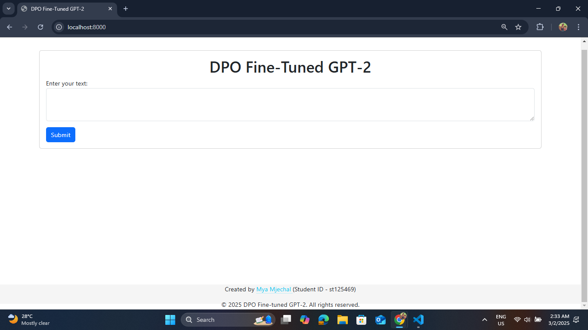
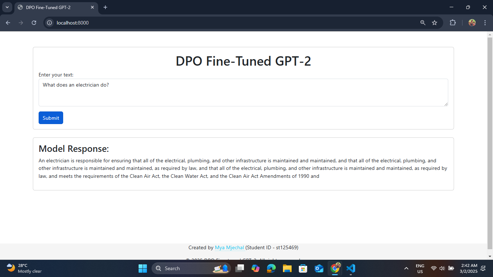

# A5: Optimization Human Preference  

**AT82.05 Artificial Intelligence: Natural Language Understanding (NLU)**  
**Instructors:** Professor Chaklam Silpasuwanchai, Todsavad Tangtortan  

## Table of Contents  
- [Student Information](#student-information)  
- [Project Overview](#project-overview)  
- [Tasks](#tasks)  
  - [Task 1: Finding a Suitable Dataset](#task-1-finding-a-suitable-dataset)  
  - [Task 2: Training a Model with DPOTrainer](#task-2-training-a-model-with-dpotrainer)  
  - [Task 3: Pushing the Model to Hugging Face Hub](#task-3-pushing-the-model-to-hugging-face-hub)  
  - [Task 4: Web Application Development](#task-4-web-application-development)  
- [Installation Setup](#installation-setup)  
- [Usage](#usage)  
- [Demo and Screenshots](#demo-and-screenshots)  
- [References](#references)  

## Student Information  
- **Name:** Mya Mjechal
- **Student ID:** st125469
- **Major:** AIT - Data Science and Artificial Intelligence (DSAI)
- **Course:** AT82.05 Artificial Intelligence: Natural Language Understanding (NLU)  
- **Assignment:** A5: Optimization Human Preference

## Project Overview  

This project explores **Direct Preference Optimization (DPO)** for training language models on **human preference data**. The goal is to fine-tune a **pre-trained transformer model** using **DPOTrainer** from Hugging Face and evaluate its ability to **optimize human preferences**. The final model is uploaded to the Hugging Face Model Hub and integrated into a **web application** for interactive demonstrations.  

The project consists of four main tasks:  

1. **Finding a Suitable Dataset** – Selecting and preprocessing an appropriate dataset for human preference optimization.  
2. **Training with DPOTrainer** – Fine-tuning a transformer model using DPO and experimenting with hyperparameters.  
3. **Pushing the Model to Hugging Face Hub** – Saving and uploading the trained model for public access.  
4. **Web Application Development** – Creating an interactive web app to showcase the trained model’s capabilities.  

## Tasks  

### Task 1: Finding a Suitable Dataset  
- **Dataset Used:** [Dahoas/rm-single-context](https://huggingface.co/datasets/Dahoas/rm-single-context)
- **Description:** This dataset contains **preference rankings** used in **reinforcement learning from human feedback (RLHF)**, making it suitable for **Direct Preference Optimization (DPO)** tasks.
- **Preprocessing Steps:**
  - Loaded the dataset from Hugging Face.
  - Split prompts and responses by extracting the prompt and separating it from the chosen and rejected responses.

### Task 2: Training a Model with DPOTrainer
- **Objective:** Fine-tune a transformer model using **Direct Preference Optimization (DPO)**.
- **Approach:**
  - Used **DPOTrainer** from Hugging Face.
  - Experimented with different **hyperparameters** for optimization.
  - Monitored **training loss** and **evaluation metrics**.
- **Pre-trained Model:** **GPT-2 model**.
- **Hyperparameters:**
    ```python
    hyperparams = [
        {"learning_rate": 1e-3,
        "per_device_train_batch_size": 8,
        "gradient_accumulation_steps": 1,
        "max_steps": 1000
        }, # Baseline setting
    ]
    ```

- **Training Performance:**

    | **Step** | **Training Loss** | **Validation Loss** | **Rewards/chosen** | **Rewards/rejected** | **Rewards/accuracies** | **Rewards/margins** | **Logps/chosen** | **Logps/rejected** | **Logits/chosen** | **Logits/rejected** |
    | -------- | ----------------- | ------------------- | ------------------ | -------------------- | ---------------------- | ------------------- | ---------------- | ------------------ | ----------------- | ------------------- |
    | 500      | 0.000000          | 3.377417            | -3.768539          | -3.538037            | 0.687500               | -0.230503           | -197.556702      | -188.285828        | -129.174255       | -128.991089         |
    | 1000     | 0.000000          | 3.547190            | -3.953837          | -3.553049            | 0.625000               | -0.400788           | -199.409683      | -188.435944        | -129.325958       | -129.258514         |

- **Training Challenges:**
    - Limited **GPU resources** led to longer training times.
    - Small **batch sizes** and **gradient accumulation** were used to handle memory constraints.
    - Only one set of hyperparameters was tested:
        ```python
        hyperparams = {
                "learning_rate": 1e-3,
                "per_device_train_batch_size": 8,
                "gradient_accumulation_steps": 1,
                "max_steps": 1000
        }
        ```
    - Suggestions for enhancement:
        - Experiment with different **learning rates** and **batch sizes**.
        - Utilize **mixed precision training** to reduce memory usage.
        - Explore **distributed training** across multiple GPUs.

### Task 3: Pushing the Model to Hugging Face Hub
- **Steps:**  
  1. Saved the trained model.
        ```python
        model.save_pretrained("dpo-gpt2-optimized-model")
        tokenizer.save_pretrained("dpo-gpt2-optimized-model")
        ```
  2. Uploaded it to Hugging Face Model Hub.
        ```python
        from huggingface_hub import HfApi

        repo_name = "myamjechal/dpo-gpt2-optimized-model"
        api = HfApi()

        # Create a new model repo if it doesn’t exist
        api.create_repo(repo_name, exist_ok=True)

        # Push model and tokenizer to Hugging Face Hub
        model.push_to_hub(repo_name)
        tokenizer.push_to_hub(repo_name)

        print(f"Model uploaded! View it here: https://huggingface.co/{repo_name}")
        ```
  3. **Model Link:** [https://huggingface.co/myamjechal/dpo-gpt2-optimized-model](https://huggingface.co/myamjechal/dpo-gpt2-optimized-model)

### Task 4: Web Application Development
- **Objective:** Create a simple web app where users can input text and receive preference-based responses.
- **Features:**
  - Accepts **user input** for human preference optimization.
  - Processes input using the **fine-tuned DPO model**.
  - Displays **model predictions** on human preference.
- **Technologies Used:**
  - **Backend:** Flask, PyTorch, Transformers
  - **Frontend:** HTML, Bootstrap

## Installation Setup

1. **Clone the Repository:**
   ```bash
   git clone https://github.com/MyaMjechal/nlp-a5-optimization-human-preference.git
   cd nlp-a5-optimization-human-preference
   ```
2. **Environment Setup:**
    - Navigate to the web application folder:
      ```bash
      cd app/code
      ```
    - Install the required dependencies:
      ```bash
      pip install -r requirements.txt
      ```
3. **Run the Web Application:**
    - Start the Flask server:
      ```bash
      python app.py
      ```
    - Open your browser and navigate to [http://localhost:8000](http://localhost:8000).

## Usage
Once the Python application is running, you can access the DPO fine-tuned GPT-2 web application by opening your browser and navigating to http://localhost:8000. From there:

1. Input **text queries** related to human preference optimization.
2. Click the "Submit" button to generate **preference-based predictions**.
3. View the **model's response**.

## Demo and Screenshots

### Demo GIF


_GIF 1: Demonstration of the preference based prediction of the fine-tune pretained model using DPO trainer on web application in action_

### Screenshots
**Web App Interface:**


_Figure 1: Initial web interface of DPO fine-tuned GPT-2_

**Sample Prediction Result:**  


_Figure 2: Prediction result of DPO fine-tuned GPT-2 with the input sentence 'What does an electrician do?'_

## References
- [DPOTrainer Documentation](https://huggingface.co/docs/trl/main/dpo_trainer)
- [Hugging Face Model Uploading Guide](https://huggingface.co/docs/hub/models-uploading)
- [Dahoas/rm-single-context Dataset](https://huggingface.co/datasets/Dahoas/rm-single-context)
